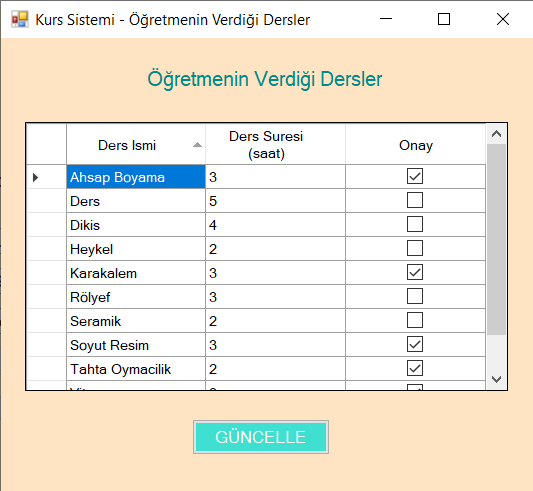

# Course-Scheduler
A course scheduler tool which is written and designed in C# / Windows Form Application. It uses MySQL as database system.

## Prerequisites
MySQL Community Server and Visual Studio needs to be installed on your computer. You can get these here: https://dev.mysql.com/downloads/mysql/ and https://visualstudio.microsoft.com/vs/

## Database Creation
Before build the program, you need to create the database in MySQL. Open up the MySQL Community Server and import the *DATABASE.SQL* file into it.

## Installation
Open up the *YM.sln* file on Visual Studio and specify the server information on the *Helper.cs* file. Open up the file and edit the *connectionString* by changing the capitalized words. Note that the database name you created must be same in the *connectionString*. Then build it.

## Screenshots

- Login Page (To login as admin, type *admin* for both of user ID and password):

  

  
- Signup Page:

  

- Courses Page:

  

- Classes Page:

  

- Students Page:

  

  
- Student Courses:

  

  
- Teachers Page:

  

  
- Teacher Classes:

  

